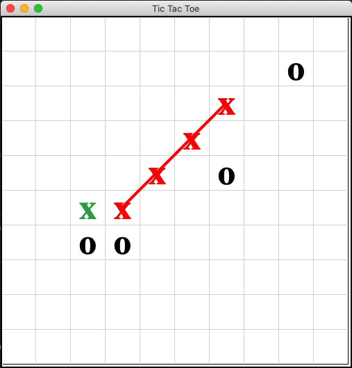

# Tic Tac Toe
Simple implementation of Tic Tac Toe game in Python using MVVM pattern without any library dependencies. The game allows you to choose the size of board and number of marks in a row, column or diagonal necessary for winning. 

It was developed as a training in MVVM patter. If you understand MVVM better or just see something you don't like in my code I would be grateful for any comments or criticism.

# Preconditions to run the game
Only thin you should need is to have the Python 3 installed. Game does not use any library dependencies, just make sure that your Python 3 distribution have tkinter.

# Running the game

To run the game execute `main.py` script.

# Playing the game

Game have only two players. 
* Human player - that is you. You can click on game board with mouse to make your move
* Random player - only AI you can play against so far. It just chose random valid move and play it

# Future plans

* Clean up the code. There are few TODO's and few places that are not MVVM compatible (Like when Model is directly communicating with View ...).
* Add some menu with buttons and labels so you can restart game, start new one after the end, chose your color and so on.
* Add another AI players. I would like to add few other AI players using ML (Alpha-Bete pruning, Reinforcement learning, Deep learning, ...)
* Add web front end and another Model View that will be a Flask server. This will be another learning experience where I would like to reuse game core (Model) and connect it to different View (web page). That way I would like to make multiplayer between two human players online and learn some more about web sockets.
